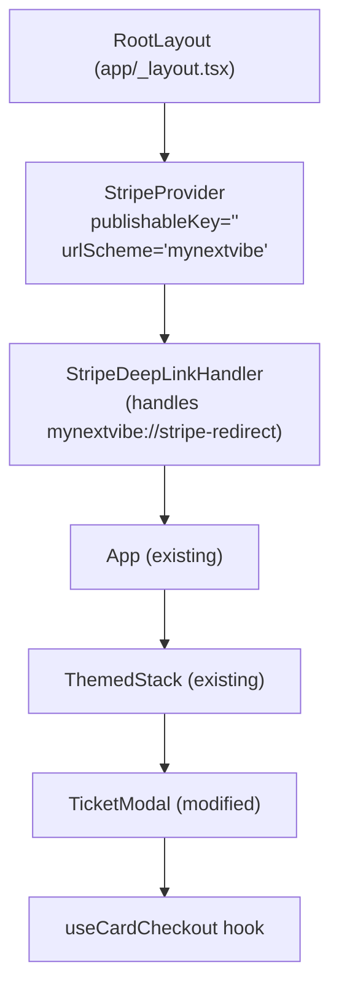

# Design Document: Stripe Card Payments

## Overview

This feature adds a parallel native payment path for non-NGN events using `@stripe/stripe-react-native`'s Payment Sheet. The existing Bachs/Ercaspay flow (NGN events, `expo-web-browser`) is untouched. The Stripe path activates automatically when a ticket tier's `settlementCurrency` is `USD`, `GBP`, `EUR`, or `CAD`.

The key design principles:

- **Server-authoritative credentials**: The publishable key and all Stripe secrets are fetched per-payment from the backend. Nothing is hardcoded or env-committed.
- **Verification-before-confirmation**: A successful `presentPaymentSheet()` call is *not* treated as ticket issuance. The app polls `GET /v1/payments/verify/:purchaseId` until a terminal status is returned.
- **Parallel, not replacement**: The Bachs checkout remains the default for NGN. Currency routing is a pure function on the selected ticket tier's `settlementCurrency`.
- **Session cleanup on logout**: `resetPaymentSheetCustomer()` is called before the navigation reset on every `clearAuth` dispatch.

### Key Correction from Requirements Doc

Requirement 2.3 mentions `customerEphemeralKeySecret`. The integration specification clarifies the correct server field name is **`customerSessionClientSecret`**, not `customerEphemeralKeySecret`. The design and implementation use `customerSessionClientSecret` throughout. The `initPaymentSheet` call maps this to its `customerSessionClientSecret` parameter.

---

## Architecture

### High-Level Flow

```mermaid
flowchart TD
    A[User taps Get Tickets] --> B[TicketModal opens]
    B --> C{settlementCurrency?}
    C -->|USD/GBP/EUR/CAD| D[Pay with Card button]
    C -->|NGN or other| E[Existing Bachs button]
    D --> F[useCardCheckout.pay()]
    F --> G[POST /payments/stripe/payment-sheet]
    G -->|success| H[initStripe publishableKey]
    G -->|error| I[Show error, stop]
    H --> J[initPaymentSheet]
    J --> K[presentPaymentSheet]
    K -->|Canceled| L[Silent dismiss]
    K -->|error| M[Show error]
    K -->|success| N[Poll GET /payments/verify/:purchaseId]
    N -->|already_completed| O[Navigate to confirmation]
    N -->|failed| P[Show failure error]
    N -->|pending × 15| Q[Show timeout / check history]
    N -->|network error| N
    E --> R[POST /payments/purchase]
    R --> S[openBrowserAsync checkoutUrl]
```

### Component Hierarchy



---

## Components and Interfaces

### New Files

```
hooks/useCardCheckout.ts              — Stripe payment lifecycle hook
components/stripe/StripeDeepLinkHandler.tsx  — Deep link → handleURLCallback
```

### Modified Files

```
store/api/paymentApi.ts              — Add initiateStripePaymentSheet mutation + verifyStripePurchase query
app/_layout.tsx                      — Add StripeProvider + StripeDeepLinkHandler + logout side effect
components/event/Rsvp/TicketModal.tsx — Currency routing + Stripe button path + busy state
components/event/Rsvp/helper.ts      — Update formatPrice for CAD symbol
app.json                             — Add @stripe/stripe-react-native plugin entry
```

### `useCardCheckout` Hook

This hook encapsulates the complete Stripe payment lifecycle. It is consumed by `TicketModal`.

```typescript
// hooks/useCardCheckout.ts

interface CardCheckoutInput {
  eventId: string;
  tierId: string;
  quantity: number;
}

type CheckoutOutcome =
  | { outcome: 'success'; purchaseId: string; tickets: TicketIssuance[] }
  | { outcome: 'cancelled' }
  | { outcome: 'error'; message: string }
  | { outcome: 'processing'; purchaseId: string };

interface UseCardCheckoutResult {
  pay: (input: CardCheckoutInput) => Promise<CheckoutOutcome>;
  busy: boolean;
}
```

**Internal state machine** (not a formal XState machine, just logical phases):

1. `idle` → `fetching` (POST to payment-sheet API)
2. `fetching` → `initialising` (initStripe + initPaymentSheet)
3. `initialising` → `presenting` (presentPaymentSheet)
4. `presenting` → `polling` | `cancelled` | `error`
5. `polling` → `success` | `failed` | `processing` | (continue on network error)

**Polling loop design:**

```
MAX_ATTEMPTS = 15
POLL_INTERVAL_MS = 2000

for attempt in 1..MAX_ATTEMPTS:
    try:
        result = await verifyPurchase(purchaseId)
        if result.status == "already_completed": return success
        if result.status == "failed": return failed
        // "pending" → wait and continue
    catch NetworkError:
        // null/network error → continue (do not increment failure count)
    await sleep(POLL_INTERVAL_MS)

return { outcome: "processing", purchaseId }  // timeout
```

Key design decision: network errors do **not** consume an attempt — the hook simply waits for the next tick. Only `"pending"` status responses consume an attempt slot.

### `StripeDeepLinkHandler` Component

A side-effect-only component mounted in the app tree. It subscribes to `Linking` events and forwards matching URLs to the Stripe SDK.

```typescript
// components/stripe/StripeDeepLinkHandler.tsx

// Listens for deep links with the scheme mynextvibe://
// Calls handleURLCallback(url) from @stripe/stripe-react-native
// on any URL — Stripe ignores URLs it doesn't own
```

It is placed inside `StripeProvider` so `handleURLCallback` has access to the Stripe context. It also handles the initial URL (app launched from a deep link while closed).

### `TicketModal` Changes

The modal gains currency-routing awareness. The primary changes are:

1. **`isStripeCurrency` helper**: A pure function exported from `helper.ts` — `(currency?: string) => boolean` — returns `true` for `['USD', 'GBP', 'EUR', 'CAD']`.
2. **`useCardCheckout` integration**: The hook is called conditionally when `isStripeCurrency(selected.currency)` is true.
3. **Button label/note swap**:
   - Stripe path: "Pay with Card" button; note reads "Secured by Stripe"
   - Bachs path: unchanged ("You'll be redirected to Ercaspay…")
4. **Busy state**: Both `isPurchasing` (Bachs) and `busy` (Stripe hook) disable the confirm button and show the loading indicator.
5. **Outcome handling**: On `success` outcome, navigate to `/purchase-confirmation?purchaseId=...`. On `error`, show a Toast. On `processing`, show a distinct Toast directing the user to check purchase history.

### `app/_layout.tsx` Changes

Two additions to `RootLayout`:

1. Wrap `RootLayoutInner` with `<StripeProvider publishableKey="" urlScheme="mynextvibe">`.
2. Mount `<StripeDeepLinkHandler />` as a sibling of `<App />` inside the provider.

One addition to `App` (or a new `useLogoutStripeCleanup` hook called from `App`):

```typescript
// Watches for clearAuth action via the auth state transition
// (isAuthenticated going from true to false)
// Calls resetPaymentSheetCustomer() before navigation resets
```

Since `clearAuth` is a Redux action and navigation reset is driven by `useAuthRouting`, the logout cleanup can be implemented as a `useEffect` watching `isAuthenticated`:

```typescript
const prevAuthenticated = useRef(isAuthenticated);
useEffect(() => {
  if (prevAuthenticated.current && !isAuthenticated) {
    resetPaymentSheetCustomer(); // called first
    // useAuthRouting will handle navigation reset on next render
  }
  prevAuthenticated.current = isAuthenticated;
}, [isAuthenticated]);
```

This guarantees `resetPaymentSheetCustomer()` executes before `useAuthRouting`'s `router.replace('/(auth)/login')`.

---

## Data Models

### TypeScript Interfaces

```typescript
// ─── Payment Sheet API ────────────────────────────────────────────────────────

/** POST /v1/payments/stripe/payment-sheet request body */
export interface InitiateStripePaymentSheetInput {
  eventId: string;
  ticketTiers: { tierId: string; quantity: number }[];
  // NOTE: no price field — server derives price from event/tier config
}

/** POST /v1/payments/stripe/payment-sheet response */
export interface StripePaymentSheetResponse {
  purchaseId: string;
  paymentIntentClientSecret: string;
  /** Used as the customerSessionClientSecret param in initPaymentSheet */
  customerSessionClientSecret: string;
  customerId: string;
  publishableKey: string;
  totalAmount: number;
  currency: string;
}

// ─── Verification API ─────────────────────────────────────────────────────────

export type VerifyPurchaseStatus = 'pending' | 'already_completed' | 'failed';

/** GET /v1/payments/verify/:purchaseId response */
export interface VerifyPurchaseResponse {
  status: VerifyPurchaseStatus;
  tickets?: TicketIssuance[];
  reason?: string; // present when status === 'failed'
}

export interface TicketIssuance {
  ticketNumber: string;
  tierName: string;
  qrCode: string;
}

// ─── Hook types ───────────────────────────────────────────────────────────────

export type CheckoutOutcome =
  | { outcome: 'success'; purchaseId: string; tickets: TicketIssuance[] }
  | { outcome: 'cancelled' }
  | { outcome: 'error'; message: string }
  | { outcome: 'processing'; purchaseId: string };

// ─── Currency routing ─────────────────────────────────────────────────────────

export const STRIPE_CURRENCIES = ['USD', 'GBP', 'EUR', 'CAD'] as const;
export type StripeCurrency = typeof STRIPE_CURRENCIES[number];

/**
 * Pure routing function — determines if a given settlementCurrency
 * should use the Stripe Payment Sheet path.
 * Undefined/null defaults to false (NGN/Bachs path).
 */
export function isStripeCurrency(currency?: string | null): boolean {
  return STRIPE_CURRENCIES.includes(currency as StripeCurrency);
}
```

### RTK Query Additions to `paymentApi`

```typescript
// Added to paymentApi endpoints:

/** POST /v1/payments/stripe/payment-sheet */
initiateStripePaymentSheet: builder.mutation<
  { success: boolean; data: StripePaymentSheetResponse },
  InitiateStripePaymentSheetInput
>({
  query: (body) => ({
    url: '/v1/payments/stripe/payment-sheet',
    method: 'POST',
    body,
  }),
}),

/** GET /v1/payments/verify/:purchaseId */
verifyStripePurchase: builder.query<
  { success: boolean; data: VerifyPurchaseResponse },
  string
>({
  query: (purchaseId) => `/v1/payments/verify/${purchaseId}`,
}),
```

Note: `verifyStripePurchase` is used imperatively via `useLazyVerifyStripePurchaseQuery` (or via RTK Query's `initiate` on the endpoint) — not as a reactive query — because the polling logic is managed by `useCardCheckout` with `setTimeout`.

### Ticket Tier Shape (existing, with `settlementCurrency`)

The existing `GET /v1/events/:id/tickets` response already has a `currency` field on each tier. The `settlementCurrency` field from the requirements maps to `ticket.currency` (or a new `settlementCurrency` field if the backend explicitly names it so). The `TicketModal` normalisation already reads `ticket.currency`, so the routing function is applied to that field.

---

## Correctness Properties

*A property is a characteristic or behavior that should hold true across all valid executions of a system — essentially, a formal statement about what the system should do. Properties serve as the bridge between human-readable specifications and machine-verifiable correctness guarantees.*

### Property 1: Currency Routing is a Total Partition

*For any* `settlementCurrency` value (including undefined and arbitrary strings), `isStripeCurrency(currency)` returns `true` if and only if the currency is exactly one of `['USD', 'GBP', 'EUR', 'CAD']`. For all other values (including `null`, `undefined`, `'NGN'`, empty string, or any unknown code), it returns `false`.

**Validates: Requirements 1.1, 1.2, 1.3**

### Property 2: Stripe SDK Is Initialised with Server-Provided Key

*For any* valid `StripePaymentSheetResponse`, when `useCardCheckout.pay()` is invoked and the Payment Sheet API succeeds, `initStripe` must be called with exactly the `publishableKey` field from that response, and `initPaymentSheet` must be called with `paymentIntentClientSecret`, `customerId`, and `customerSessionClientSecret` matching the response, plus `returnURL === 'mynextvibe://stripe-redirect'` and `allowsDelayedPaymentMethods === false`.

**Validates: Requirements 2.2, 2.3, 5.2**

### Property 3: API Failure Prevents Sheet Presentation

*For any* error response from the Payment Sheet API (network error, 4xx, or 5xx), `presentPaymentSheet` must never be called, and the hook must return an `{ outcome: 'error', message }` result where `message` is non-empty.

**Validates: Requirements 2.6, 2.7**

### Property 4: Non-Canceled Payment Sheet Error Sets Error State

*For any* error returned by `presentPaymentSheet` whose `code` is not `Canceled`, the hook must return `{ outcome: 'error', message }` where `message` contains the error's description string.

**Validates: Requirements 3.4**

### Property 5: Terminal Poll Status Produces Correct Outcome

*For any* `purchaseId` and any poll attempt index (1 through 15) at which the Verify API returns a terminal status: if the status is `"already_completed"`, the outcome is `{ outcome: 'success', purchaseId, tickets }` where `tickets` matches the response; if the status is `"failed"`, the outcome is `{ outcome: 'error', message }` where `message` includes the server-supplied `reason`.

**Validates: Requirements 4.2, 4.3**

### Property 6: Poll Timeout Produces Processing Outcome

*For any* `purchaseId` where all 15 poll attempts return `"pending"`, the hook must return `{ outcome: 'processing', purchaseId }` with the same `purchaseId` that was returned by the Payment Sheet API.

**Validates: Requirements 4.4**

### Property 7: Network Errors During Polling Do Not Terminate the Loop

*For any* poll attempt index at which a network error occurs, the hook must continue polling on the next tick and must not return a terminal error outcome solely due to that network error.

**Validates: Requirements 4.5**

### Property 8: Deep Link URLs Are Forwarded to the Stripe SDK

*For any* URL received via the `mynextvibe://` scheme, the `StripeDeepLinkHandler` must call `handleURLCallback(url)` with that exact URL string.

**Validates: Requirements 5.3**

### Property 9: Busy State Prevents Re-Entry

*For any* state where the `useCardCheckout` hook has `busy === true` (i.e., a payment is in progress — during API call, sheet presentation, or polling), the `TicketModal` confirm button's `disabled` prop must be `true`.

**Validates: Requirements 8.1, 8.2**

### Property 10: Price Formatting Preserves Currency Symbol

*For any* non-zero price value and any settlement currency, `formatPrice(price, currency)` must return a string that: (a) contains a recognisable currency symbol or the ISO code as prefix, and (b) contains the numeric price value without device-locale number reformatting.

**Validates: Requirements 8.5**

---

## Error Handling

### API Call Failures

| Failure point | Behaviour |
|---|---|
| Payment Sheet API network error | Hook returns `{ outcome: 'error', message: 'Network error. Please try again.' }` |
| Payment Sheet API 4xx/5xx | Hook returns `{ outcome: 'error', message: server.message ?? 'Payment setup failed.' }` |
| `initStripe` error | Hook returns `{ outcome: 'error', message: 'Could not configure payment.' }` |
| `initPaymentSheet` error | Hook returns `{ outcome: 'error', message: error.message }` |
| `presentPaymentSheet` Canceled | Hook returns `{ outcome: 'cancelled' }` — no error shown |
| `presentPaymentSheet` other error | Hook returns `{ outcome: 'error', message: error.message }` |
| Verify API all-pending timeout | Hook returns `{ outcome: 'processing', purchaseId }` |
| Verify API `failed` status | Hook returns `{ outcome: 'error', message: reason ?? 'Payment failed.' }` |
| Verify API network error | Loop continues — not a terminal state |

### `TicketModal` Error Display

- `outcome: 'error'` → `Toast.show({ type: 'error', text1: 'Payment failed', text2: message })`
- `outcome: 'processing'` → `Toast.show({ type: 'info', text1: 'Payment processing', text2: 'Check your purchase history for confirmation.' })`
- `outcome: 'cancelled'` → no UI feedback (silent dismiss)
- `outcome: 'success'` → modal dismissed; navigate to `/purchase-confirmation?purchaseId=...`

### `StripeDeepLinkHandler` Error Handling

`handleURLCallback` does not throw for unrecognised URLs; the Stripe SDK silently ignores them. No error handling is required beyond standard try/catch logging.

---

## Testing Strategy

### Unit Tests

- `isStripeCurrency` pure function — example-based table tests for all explicit values and several arbitrary strings
- `formatPrice` — example-based tests for each currency symbol, zero price, and non-integer prices
- `paymentApi` mutation and query query-builder functions — verify URL, method, and body shape
- `StripeDeepLinkHandler` — mock `Linking` and `handleURLCallback`, verify forwarding
- `useCardCheckout` — mock RTK Query mutations and all Stripe SDK functions; test each outcome branch with specific examples:
  - API failure path
  - Canceled sheet path
  - Non-Canceled error path
  - `already_completed` on first poll
  - `failed` on third poll
  - All-pending timeout
  - Network error on attempt 5, then success on attempt 6

### Property-Based Tests

The project uses `@stripe/stripe-react-native` and its test utilities. For PBT, use **fast-check** (framework-agnostic, works with Jest/Vitest). Configure each property test to run a minimum of **100 iterations**.

Each property-based test must include a tag comment:
```typescript
// Feature: stripe-card-payments, Property N: <property title>
```

**Properties to implement:**

| Property | Test approach | fast-check arbitraries |
|---|---|---|
| P1: Currency routing partition | `fc.string()` for arbitrary currencies; also enumerate known values | `fc.oneof(fc.constantFrom('USD','GBP','EUR','CAD','NGN','JPY'), fc.string())` |
| P2: SDK initialised with server key | `fc.record({ publishableKey: fc.string(), ... })` for mock responses | `fc.record(...)` for full StripePaymentSheetResponse |
| P3: API failure prevents sheet presentation | `fc.oneof(fc.constant(networkError), fc.record({ status: fc.integer({min:400,max:599}) }))` | Various error shapes |
| P4: Non-Canceled error sets error state | `fc.constantFrom(...errorCodes).filter(c => c !== 'Canceled')` | Error code enumeration |
| P5: Terminal status produces correct outcome | `fc.integer({min:1,max:15})` for attempt index, `fc.constantFrom('already_completed','failed')` | Varied attempt + response |
| P6: Timeout → processing outcome | Fixed: 15 pending responses; `fc.string()` for purchaseId | purchaseId variation |
| P7: Network errors continue polling | `fc.integer({min:1,max:14})` for error attempt | Error position variation |
| P8: Deep links forwarded | `fc.string()` appended to `mynextvibe://stripe-redirect` | URL variation |
| P9: Busy disables button | Hook in any in-progress state | State injection |
| P10: Price formatting | `fc.float({min:0.01})` × supported currencies | price/currency pairs |

### Integration Tests

- `StripeProvider` is present in the app root with correct props (snapshot/render test)
- `app.json` contains `"scheme": "mynextvibe"` and the `@stripe/stripe-react-native` plugin (static file assertion)
- `resetPaymentSheetCustomer` is called on `clearAuth` dispatch before navigation reset (mock + dispatch test)

